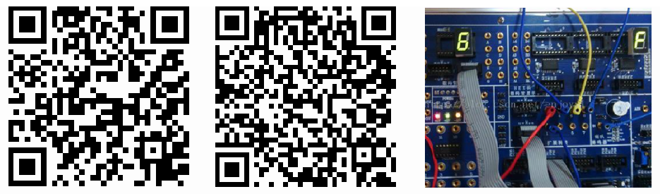

# 创意创新项目

## Electronic Organ

具有自动乐曲演奏功能的电子琴设计， [more](./ElectronicOrgan/index.md)

- 博客：[https://blog.csdn.net/enjoyyl/article/details/11554313](https://blog.csdn.net/enjoyyl/article/details/11554313)
- 视频：[https://pan.baidu.com/share/link?shareid=3864130687&uk=3441381669](https://pan.baidu.com/share/link?shareid=3864130687&uk=3441381669)

原理链接 (左), 视频链接 (中), 实物图 (右)

## Human Health Analyzer

人体健康分析仪 [more](./HumanHealthAnalyzer/index.md)

