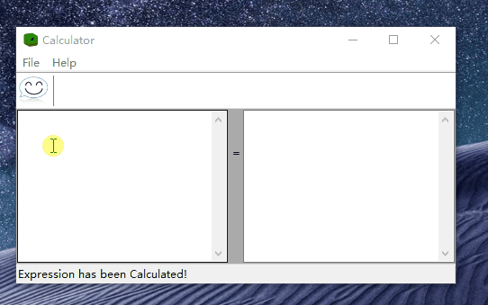
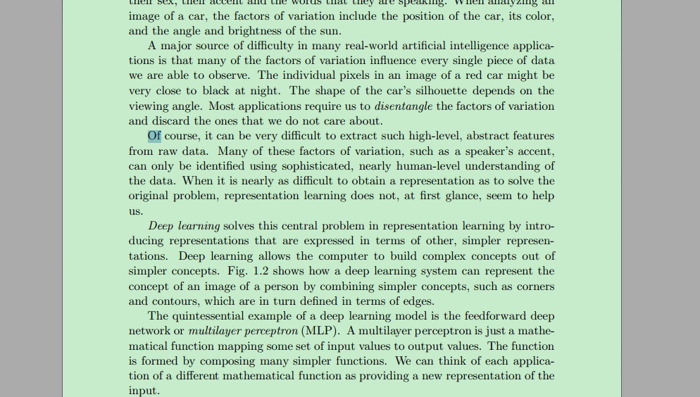

# 软件类项目

以下发布版软件可在 [这里](https://share.weiyun.com/BF3YPZJc) 下载使用.

## 基于WxLua的计算器

2017年基于WxLua开发的实时科学计算器, 效果图如下:

## 基于WxLua的文本纠正器

2016年基于WxLua开发的文本纠正器, 自动去掉复制PDF段落文本导致换行符, 效果图如下:

## 基于VB的音乐播放器

2011年, 本人大二时基于Virtual Basic语言开发的一款音视频播放器, 可添加书签, 可复读.

